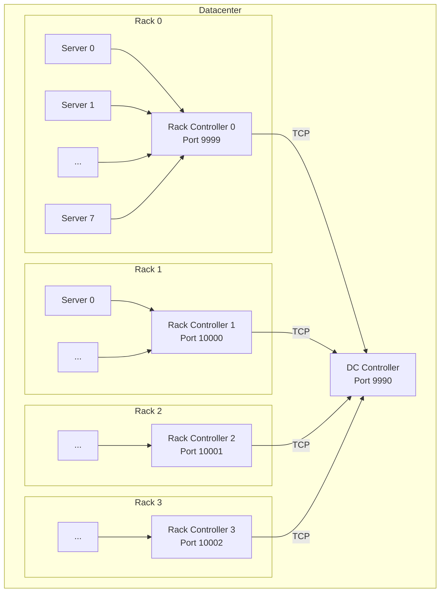

# NetWatch Architecture

NetWatch is a hierarchical network monitoring system that uses spectral analysis to detect anomalies.

## Component Hierarchy

## Components

### Server Agent (`server_agent.py`)
- Generates sinusoidal wave samples at a unique frequency
- Frequency formula: `base_freq + 0.05 * server_id` where `base_freq = 1 + rack_id`
- Sends UDP packets every 50ms (20 Hz) to its rack controller
- Packet payload: `{rack_id, server_id, seq, sent_ts, wave_sample}`

### Rack Controller (`rack_controller.py`)
- Receives UDP packets from all servers in its rack
- Maintains per-server statistics: packet counts, latencies, wave buffer
- Runs FFT analysis every 5 seconds to compute spectral error
- Reports rack health score to DC Controller via TCP

### DC Controller (`dc_controller.py`)
- Receives TCP health reports from all rack controllers
- Aggregates rack scores to compute datacenter-wide health
- Logs datacenter summary every 10 seconds

## Health Scoring

### Spectral Error
Computed from FFT analysis:
- **0.0** = Pure signal at expected frequency
- **1.0** = Pure noise, no signal detected

### Health Classification
| Level | Spectral Error | Status |
|-------|---------------|--------|
| Healthy | < 0.2 | ✅ Normal |
| Sev2 | 0.2 - 0.5 | ⚠️ Warning |
| Sev1 | > 0.5 | 🔴 Critical |

### Aggregation
- **Rack Health** = `1 - avg(server_spectral_errors)`
- **DC Health** = `avg(rack_health_scores)`

## Data Flow

1. **Server → Rack Controller** (UDP, 20 Hz)
   - Wave samples, sequence numbers, timestamps

2. **Rack Controller → DC Controller** (TCP, every 5s)
   - `{rack_id, health_score, server_count, timestamp}`

3. **Logs** (stdout, every 5-10s)
   - Per-server stats, rack health, DC health
